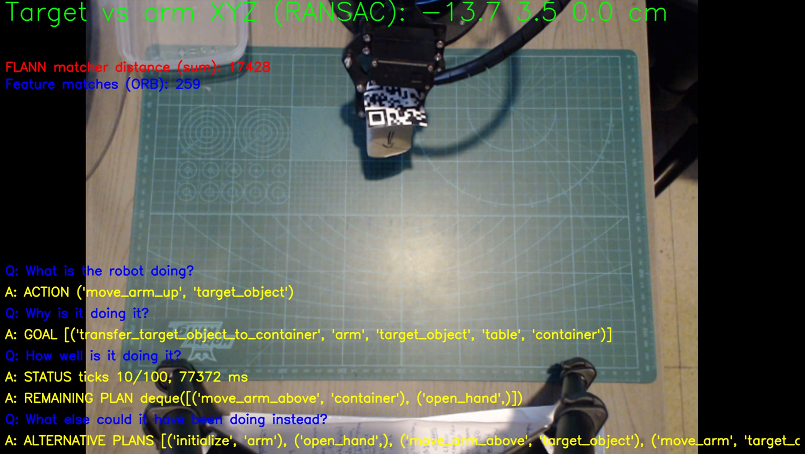

# Robotics project: 6 DOF arm manipulation, utilizing knowledge-based reasoning, BDI and HTN planning

Means-end, practical reasoning using Belief-Desire-Intention (BDI) architecture.

Demo: https://youtu.be/lO22-RkgV2Y

Presentation: https://1drv.ms/b/s!AgM7aH_rFcPzgrdkwJNIGvczvEBOaQ

## Goal
Create a succeeding and a failing scenario, for a:
- Robotic arm manipulator.
- Carrying objects from a desk to a container.

### Questions & Answers [BSSL19]:
Q: What is the robot doing? A: ACTION or FAILED

Q: Why is it doing it? A: GOAL

Q: How well is it doing it? A: STATUS & REMAINING PLAN

Q: What else could it have been doing instead? A: ALTERNATIVE PLANS

### Robotic arm
LewanSoul LeArm (60 gram servos, serial I/O):

- 6 degrees of freedom.
- Primitive control: servo positions in [500, 2500].

### Communication
Wi-Fi 2.4GHz with ESP32 (Arduino compatible micro-controller):

- Restful API (GET/PUT) for servo position, speed and delay.
- Average Round Trip Time (RTT):  1-2ms (warmed, after 2 packets).

### Perception
Logitech C920 camera for computer vision:

- 1920 x 1080 max resolution (3 MP), 30 max frames per second.

### Computer Vision
Object position detection (centimeter-level 3D detection of QR code) with partial obscuring (Python library: OpenCV):

- Oriented far and Rotated Brief (ORB) [RRKB11] feature detection.
- Fast Library for Approximate Nearest Neighbors (FLANN) [MM11] feature matching and homography perspective transformation.
- Pixels-to-XYZ: RANdom SAmple Consensus (RANSAC) [FB02].

### World Model (now & history):
- JSON in-memory nested data-structure for fast I/O.

### Planner
- Hierarchical Task Network (HTN) [EHN94, GNT16]. Python library: pyhop.

### Control
- Arm: Forward and Inverse kinematic model.
- Gripper opening control: From centimeters 2 [0:5; 6:0] to servo value [500; 2500].
- Trajectories: Discretization of start and target position of end-effector.
- Collision avoidance: Knowledge-based on target object location, dimensions & action (i.e
moveTo, moveUp, moveAbove etc).

### Monitoring
- Events: From sensor percepts , to event firing.

### Task Model [BSSL19]

### Real-Time Clock (RTC) & Multi-Agent support:
BDI uses the Smart Python Agent Development Environment (SPADE) library:

- Real-time, behaviour-based agent model platform.
- Multi-Agent Instant Messaging (IM) and presence notification via:
  - Extensible Messaging and Presence Protocol (XMPP).
  - Foundation for Intelligent Physical Agents (FIPA) metadata and the Agent Communication Language (ACL). 
- Asynchronous IO.

#### References

[BHW07] Rafael H. Bordini, Jomi Fred Hubner, and Michael Wooldridge. Programming Multi-Agent Systems in AgentSpeak using Jason. 2007.

[BIP88] Michael E. Bratman, David J. Israel, and Martha E. Pollack. Plans and resource and bounded practical reasoning. Computational Intelligence, 1988.

[BSSL19] Herman Bruyninckx, Christian Schlegel, Dennis Stampfer, and Alex Lotz. Composable, explainable and verifiable robotics and cyber-physical systems-of-systems: best practices and knowledge-based meta models for resilient holonic architectures. 2019.

[EHN94] Kutluhan Erol, James Hendler, and Dana S. Nau. Semantics for Hierarchical Task-Network Planning. Technical report, 1994.

[FB02] Martin A. Fischler and Robert C. Bolles. Random sample consensus: a paradigm for model fitting with applications to image analysis and automated cartography. Communications of the ACM, 2002.

[GNT16] Malik Ghallab, Dana Nau, and Paolo Traverso. Automated Planning and Acting. 2016.

[GPP+07] Michael Georgeff, Barney Pell, Martha Pollack, Milind Tambe, and Michael Wooldridge. The Belief-Desire-Intention Model of Agency. 2007.

[MM11] David G. Lowe Marius Muja. FAST APPROXIMATE NEAREST NEIGHBORS WITH AUTOMATIC ALGORITHM CONFIGURATION. 2011.

[RG97] Anand S. Rao Rao and Michael P. Georgeff. Modeling rational agents within a BDI-architecture. Readings in agents, 1997.

[RRKB11] Ethan Rublee, Vincent Rabaud, Kurt Konolige, and Gary Bradski. ORB: An efficient alternative to SIFT or SURF. In Proceedings of the IEEE International Conference on Computer Vision, 2011.

[Wei] Gerhard Weiss. Multiagent systems.

[Woo02] M. Wooldridge. Introduction to MultiAgent Systems. Information Retrieval, 2002.

#### LICENSE

Robotic Arm
Copyright (c) 2018, Konstantinos Theodorakos (email: madks@hotmail.com).
All rights reserved.

This program is free software; you can redistribute it and/or
modify it under the terms of the GNU General Public License
as published by the Free Software Foundation; either version 3
of the License, or (at your option) any later version.

This program is distributed in the hope that it will be useful,
but WITHOUT ANY WARRANTY; without even the implied warranty of
MERCHANTABILITY or FITNESS FOR A PARTICULAR PURPOSE.  See the
GNU General Public License for more details.

You should have received a copy of the GNU General Public License
along with this program; if not, write to the Free Software
Foundation, Inc., 51 Franklin Street, Fifth Floor, Boston, MA  02110-1301, USA.